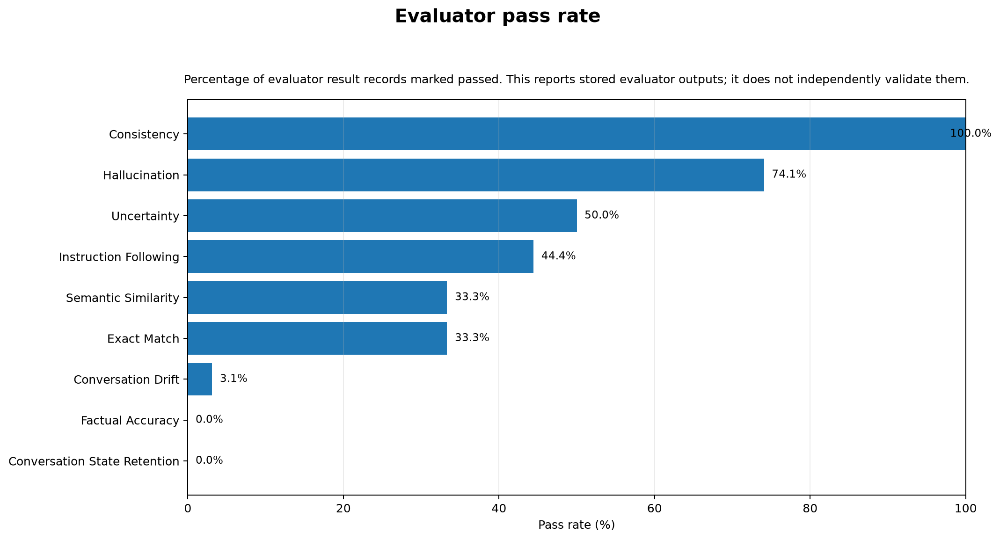
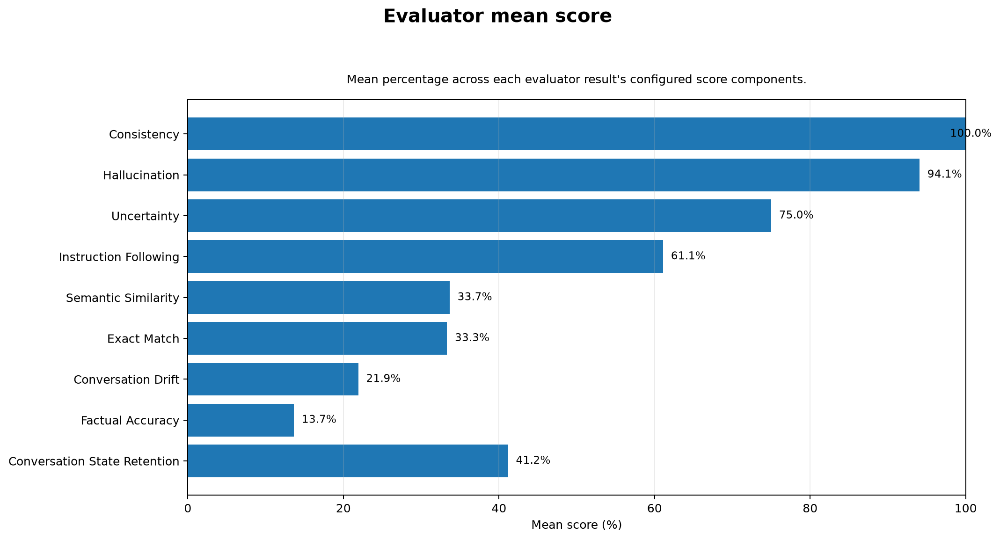
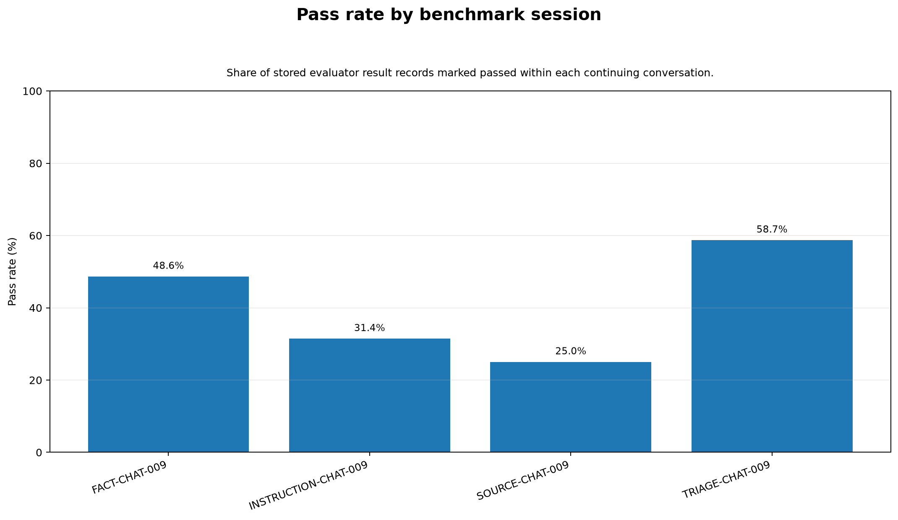
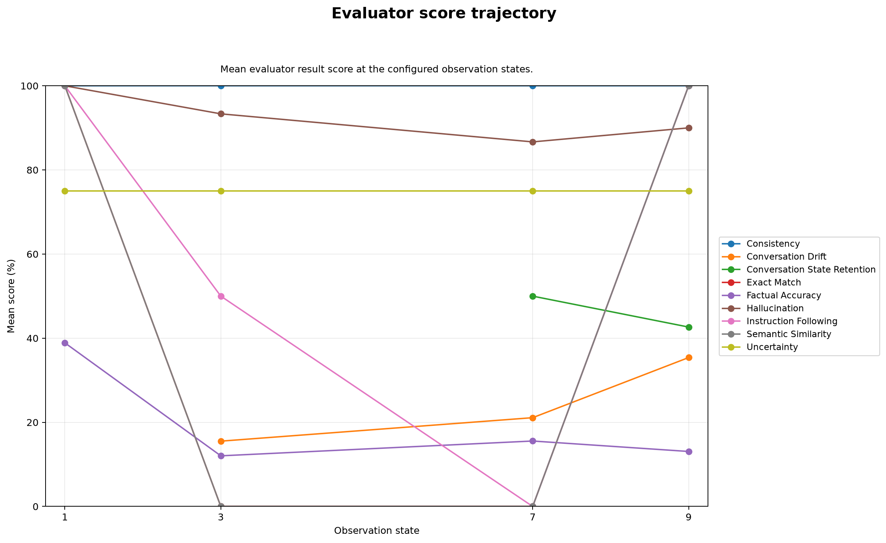
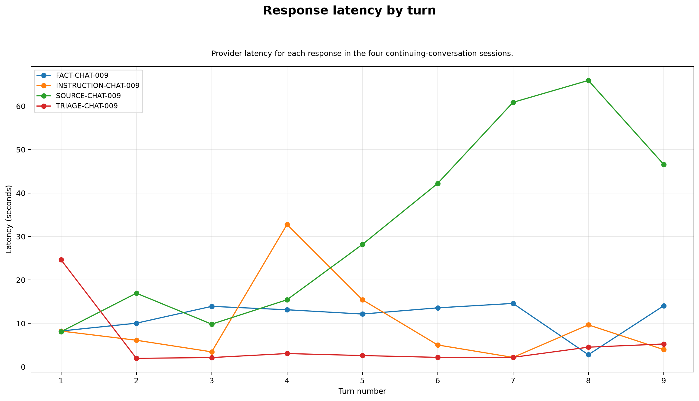
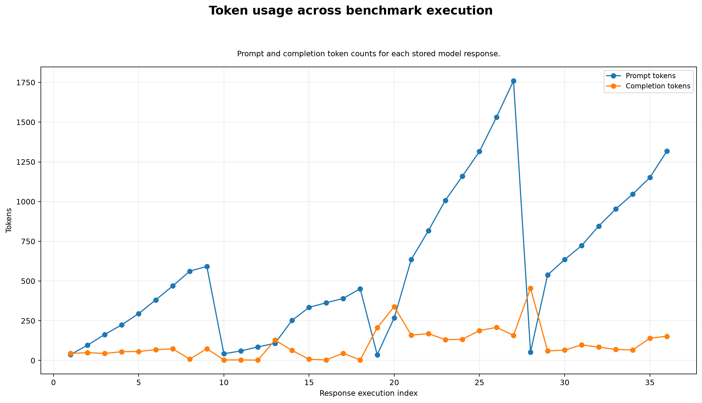

# GenAI Evaluation Matrix Benchmark Report

**Run ID:** `20260718T171919_161937Z_ollama_llama3_2_latest`  
**Generated:** `2026-07-18T17:28:30.391552+00:00`  
**Provider:** `ollama`  
**Model:** `llama3.2:latest`  
**Run status:** `completed`

## Evidence integrity

This report is generated only from the stored run evidence. It does not call a provider, rerun an evaluator, verify external facts, or fill missing values. The charts visualise the evaluator outputs present in this run; evaluator correctness must be audited separately.

| Evidence item | Count |
| --- | --- |
| Raw provider responses | 36 |
| Evaluator result records | 162 |
| Evaluator score rows | 302 |
| Completed model responses | 36 |
| Failed model responses | 0 |
| Evaluator execution errors | 0 |

## Evaluator results

| Evaluator | Records | Passed | Failed | Pass rate | Mean score |
| --- | --- | --- | --- | --- | --- |
| Conversation State Retention | 4 | 0 | 4 | 0.0% | 41.2% |
| Factual Accuracy | 27 | 0 | 27 | 0.0% | 13.7% |
| Conversation Drift | 32 | 1 | 31 | 3.1% | 21.9% |
| Exact Match | 9 | 3 | 6 | 33.3% | 33.3% |
| Semantic Similarity | 9 | 3 | 6 | 33.3% | 33.7% |
| Instruction Following | 9 | 4 | 5 | 44.4% | 61.1% |
| Uncertainty | 18 | 9 | 9 | 50.0% | 75.0% |
| Hallucination | 27 | 20 | 7 | 74.1% | 94.1% |
| Consistency | 27 | 27 | 0 | 100.0% | 100.0% |

## Session results

| Session | Evaluator records | Passed | Failed | Pass rate |
| --- | --- | --- | --- | --- |
| FACT-CHAT-009 | 37 | 18 | 19 | 48.6% |
| INSTRUCTION-CHAT-009 | 35 | 11 | 24 | 31.4% |
| SOURCE-CHAT-009 | 44 | 11 | 33 | 25.0% |
| TRIAGE-CHAT-009 | 46 | 27 | 19 | 58.7% |

## Observation-state trajectory

| Evaluator | State 1 | State 3 | State 7 | State 9 |
| --- | --- | --- | --- | --- |
| Consistency | 100.0% | 100.0% | 100.0% | 100.0% |
| Conversation Drift | n/a | 15.5% | 21.1% | 35.4% |
| Conversation State Retention | n/a | n/a | 50.0% | 42.6% |
| Exact Match | 100.0% | 0.0% | 0.0% | 100.0% |
| Factual Accuracy | 38.9% | 12.0% | 15.6% | 13.1% |
| Hallucination | 100.0% | 93.3% | 86.7% | 90.0% |
| Instruction Following | 100.0% | 50.0% | 0.0% | 100.0% |
| Semantic Similarity | 100.0% | 0.0% | 0.0% | 100.0% |
| Uncertainty | 75.0% | 75.0% | 75.0% | 75.0% |

## Generated graphs

### 01 Evaluator Pass Rate

### 02 Evaluator Mean Score

### 03 Session Pass Rate

### 04 Observation State Trajectory

### 05 Response Latency

### 06 Token Usage

## Source evidence files

- `run_manifest.json`
- `run_summary.json`
- `raw_provider_responses.jsonl`
- `transcripts.json`
- `evaluation_results.jsonl`
- `evaluation_scores.csv`
